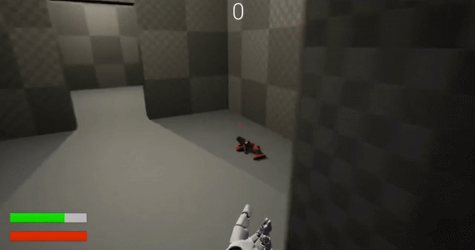

<h1 align="center">🎮 UE4 FPS Demo 🎮</h1> 

  

## Overview 📖
A 'first person shooter' technical demonstration which utilises many different aspects of Unreal Engine 4. It is coded primarily in C++, but blueprints is also used when needed. This project was created as part of my 'Game Engine Programming' module at University where I had to build a game with a single level and incorporate systems such as custom weapons, an ability and pickups which affect the character.

## Details 👨‍💻

### Technologies
* C++
* Unreal Engine 4
* Blueprints

### Features
* An inventory system whereby the player can pick up and equip guns
* A sprinting ability
* A graphical UI which displays stamina, health and score
* Enemies which charge at and shoot the player
* Hitscan and projectile based weapons
* A pickup system

## Visuals 🎬

Add items to your inventory and equip them:

Use different weapon types (hitscan and projectile):

Sprint using stamina which is displayed with a GUI:

